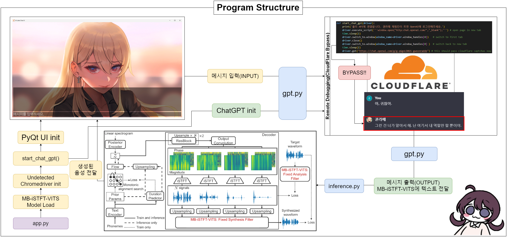

# AI-LATTE

# The repository is only accessible to people aged 19 and over. *PLEASE DO NOT CHECK* the repository for teenagers or children.

Implementation of a CHATBOT Using [MB-iSTFT-VITS](https://github.com/ORI-Muchim/MB-iSTFT-VITS-Korean) and [ChatGPT](https://chat.openai.com/)




## Table of Contents 
- [Prerequisites](#prerequisites)
- [Installation](#installation)
- [Usage](#usage)
- [References](#references)

## Prerequisites
- ChatGPT4
- A Windows system with a minimum of `16GB` RAM.
- Python == 3.8
- Anaconda installed.
- PyTorch installed.

Pytorch install command:
```sh
pip install torch==1.13.1+cu117 torchvision==0.14.1+cu117 torchaudio==0.13.1 --extra-index-url https://download.pytorch.org/whl/cu117
```

---

## Installation 
1. **Create an Anaconda environment:**

```sh
conda create -n latte python=3.8
```

2. **Activate the environment:**

```sh
conda activate latte
```

3. **Clone this repository to your local machine:**

```sh
git clone https://github.com/ORI-Muchim/AI-LATTE.git
```

4. **Navigate to the cloned directory:**

```sh
cd AI-LATTE
```

5. **Install the necessary dependencies:**

```sh
pip install -r requirements.txt
```

---

## Usage

To start this application, use the following command:

```sh
python app.py
```

---
## References

For more information, please refer to the following repositories: 
- [MasayaKawamura/MB-iSTFT-VITS](https://github.com/MasayaKawamura/MB-iSTFT-VITS) 
- [ORI-Muchim/MB-iSTFT-VITS-Korean](https://github.com/ORI-Muchim/MB-iSTFT-VITS-Korean)
- [ORI-Muchim/PolyLangVITS](https://github.com/ORI-Muchim/PolyLangVITS)
- [tenebo/g2pk2](https://github.com/tenebo/g2pk2)