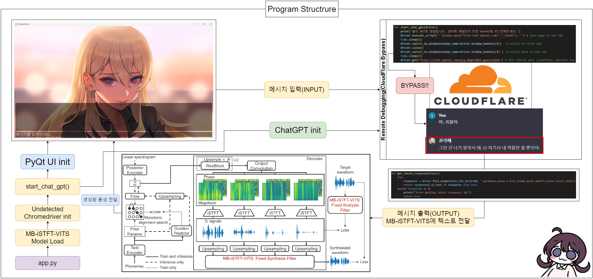

# AI-LATTE

# 해당 레포지토리는 19세 이상만 접근할 수 있습니다. 청소년이나 어린이는 이 레포지토리를 접근하지 마십시오. ㅠㅠ

## 만약 리소스 파일이 필요하다면, 연구 목적으로 제공해드릴 수 있습니다. Discord: 오리무침#7777

[Original README.md](./README.md)

온파이어 게임즈의 러브 딜리버리 히로인 권라떼, [ChatGPT](https://chat.openai.com/)와 [MB-iSTFT-VITS](https://github.com/ORI-Muchim/MB-iSTFT-VITS-Korean)를 사용한 비공식 구현



## 목차
- [필수요소](#필수요소)
- [설치](#설치)
- [사용](#사용)
- [참고](#참고)

## 필수요소
- **ChatGPT4**
- 램 용량 `8GB`이상인 윈도우, 리눅스, 맥OS 시스템
- Python == 3.8
- 아나콘다 설치
- 파이토치 설치

파이토치 설치 명령어(CUDA(NVIDIA) 그래픽카드 사용자):
```sh
pip install torch==1.13.1+cu117 torchvision==0.14.1+cu117 torchaudio==0.13.1 --extra-index-url https://download.pytorch.org/whl/cu117
```

파이토치 설치 명령어(CPU 사용자):
```sh
pip install torch==1.13.1+cpu torchvision==0.14.1+cpu torchaudio==0.13.1 --extra-index-url https://download.pytorch.org/whl/cpu
```

---

## 설치
1. **아나콘다 환경 만들기:**

```sh
conda create -n latte python=3.8
```

2. **가상환경 활성화:**

```sh
conda activate latte
```

3. **해당 레포지토리를 PC 로컬 계정에 복사:**

```sh
git clone https://github.com/ORI-Muchim/AI-LATTE.git
```

4. **해당 경로로 이동:**

```sh
cd AI-LATTE
```

5. **필요한 종속성 설치:**

```sh
pip install -r requirements.txt
```

---

## 사용

라떼와 대화하고 싶다면 해당 명령어를 입력:

```sh
python app.py
```

---
## 참고

자세한 내용은 다음 리포지토리를 참조하십시오: 
- [MasayaKawamura/MB-iSTFT-VITS](https://github.com/MasayaKawamura/MB-iSTFT-VITS) 
- [ORI-Muchim/MB-iSTFT-VITS-Korean](https://github.com/ORI-Muchim/MB-iSTFT-VITS-Korean)
- [ORI-Muchim/PolyLangVITS](https://github.com/ORI-Muchim/PolyLangVITS)
- [tenebo/g2pk2](https://github.com/tenebo/g2pk2)

이 프로젝트는 영리적 목적으로 생성된 것이 아닌, 단순 연구용으로 만든 것을 밝힙니다.
